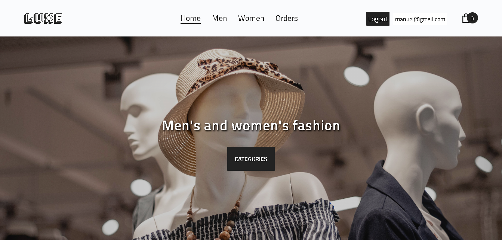
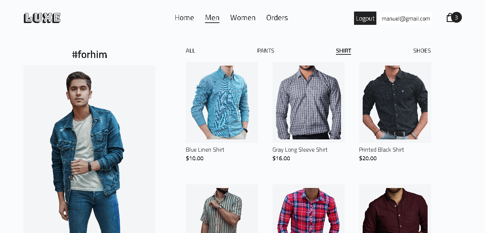
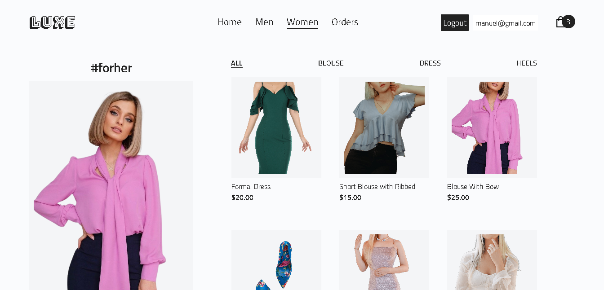
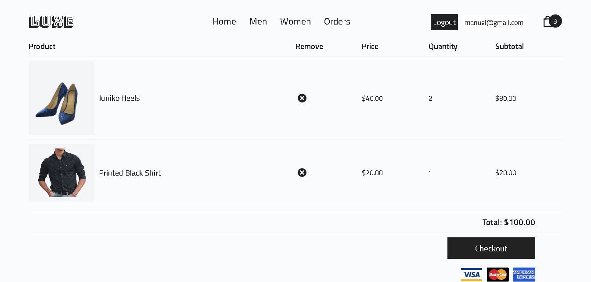

# Clothing And Shoe Store 🛍️

This project is a clothing and footwear store developed with ReactJS. It communicates with a backend developed with Node.js that utilizes Stripe for payment processing and allows saving user data and orders in MongoDB. It offers an intuitive and secure shopping experience. [Click here to see the project](https://clothing-and-shoe-store.netlify.app/ "click here to see the project")

